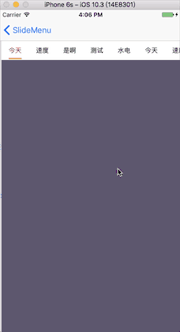
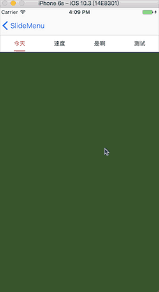

##### CKSlideMenu 介绍

------


​	闲来无事，看到半塘的滚动菜单的动画还是蛮有意思的。所以写了这个一个东西，效果如下：


    		


> 当数组元素个数较少时，会固定顶部的滚动视图，重新布局位置

   


###### 1.主要属性

```swift
    // 选中颜色
    var selectedColor:UIColor       = UIColor.red 
    // 未选中颜色
    var unSelectedColor:UIColor     = UIColor.black 
    // 下标宽度
    var indicatorWidth:CGFloat      = 30   //SlideMenuIndicatorStyle 为normal时有效
    // 下标高度
    var indicatorHeight:CGFloat     = 2 
    // 下标距离底部距离
    var bottomPadding:CGFloat       = 2 
    // 标题字体
    var font:UIFont                 = UIFont.systemFont(ofSize: 13)
    //下标样式
    var indicatorStyle:SlideMenuIndicatorStyle = .stretch
	//标题样式
	var titleStyle:SlideMenuTitleStyle = .normal
```


###### 2.样式

```swift
enum SlideMenuTitleStyle {
    case normal             //默认
    case gradient           //颜色渐变
    case transfrom          //放大
}

enum SlideMenuIndicatorStyle {
    case normal             //常规
    case followText         //跟随文本长度
    case stretch            //伸缩  默认(推荐哦)
    //followText和stretch的区别在于 后者有一个偏位移的动画视差
}
```


###### 3.使用方法

```swift

let titles = ["今天","速度100","是啊","测试机","水电","今天","速度","是啊","今天","速度","是啊"]
    var arr:Array<UIViewController> = []
    for _ in 0 ..< titles.count {
      let vc = CKChildViewController()
      self.addChildViewController(vc)
      arr.append(vc)
    }
    //初始化slideMenu
    slideMenu = CKSlideMenu(frame: CGRect(x:0,y:64,width:view.frame.width,height:40), titles:titles, childControllers:arr)
    slideMenu?.titleStyle = .gradient
    slideMenu?.selectedColor = UIColor.orange
    slideMenu?.unSelectedColor = UIColor.gray
    //        slideMenu?.font = UIFont.systemFont(ofSize: 10)
    view.addSubview(slideMenu!)
```
上述属性均可设置来满足不同的效果

[代码地址：https://github.com/90ck/CKSlideMenu](https://github.com/90ck/CKSlideMenu)


<!--如不能满足需求，可联系我讨论 QQ:907856372-->

